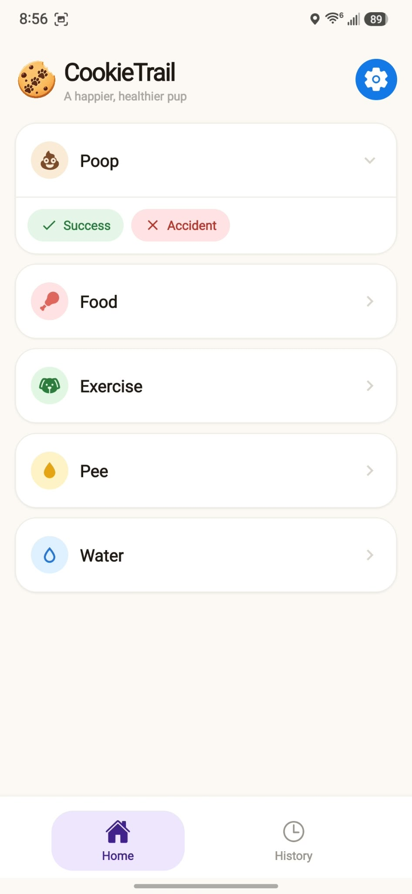
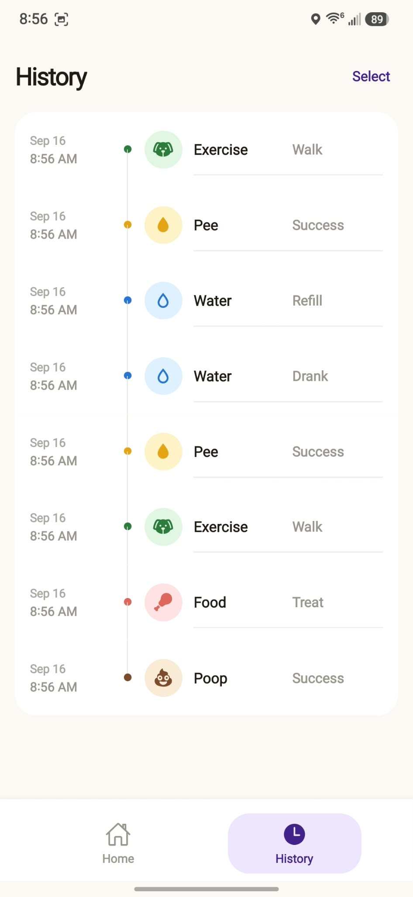
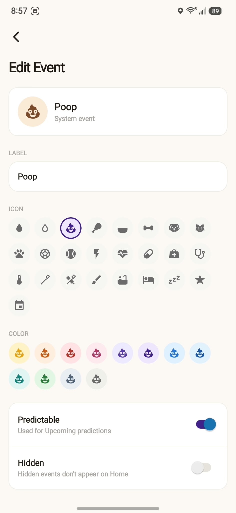

<p align="center">
  
</p>

<h1 align="center">CookieTrail</h1>

<p align="center">A local-first mobile app for quickly logging your pup's routine.</p>

CookieTrail keeps pet tracking simple: swipe or tap to record an event, review the timeline, and customize the events that matter to you. Data stays on the device in SQLite.

<p align="center">
  
  &nbsp;
  
  &nbsp;
  
</p>

## Features

- Fast event logging with swipe actions or option buttons
- Editable history with selection and bulk deletion
- Custom event types, options, colors, icons, and ordering
- Offline, on-device persistence

## Development

Requires Node.js and the Expo development toolchain.

```bash
npm install
npm start
```

Use `npm run android` or `npm run ios` for a native development build. Run `npm run lint` before submitting changes.

## Android releases

Add an Expo access token as the `EXPO_TOKEN` GitHub Actions secret, then push a version tag:

```bash
git tag v1.0.0
git push origin v1.0.0
```

The release workflow builds and attaches a versioned APK to the GitHub release.
